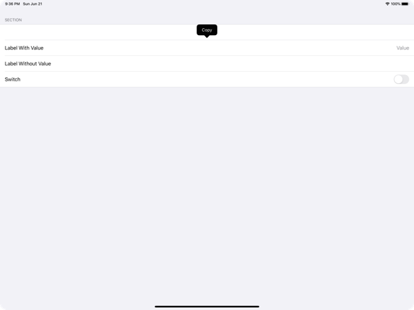

# EurekaCopyMenu

The EurekaCopyMenu project demonstrates how to add a Copy menu to [Eureka](https://github.com/xmartlabs/Eureka) forms to copy the value of LabelRows.

## How To

1. Copy the [`EurekaExtras.swift`](https://github.com/alldritt/EurekaCopyMenu/blob/master/EurekaCopyMenu/EurekaExtras.swift) file to your project
2. Make your form's view controller inherit from `EurekaFormViewController` instead of `EurekaFormViewController`

Thats it...
